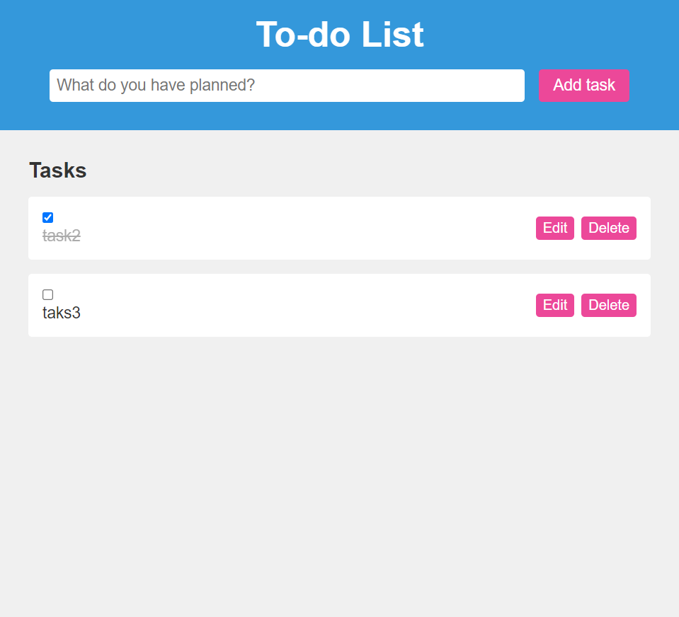

# To-do List

A simple web-based to-do list application built with HTML, CSS, and JavaScript.

## Overview

This project is a web-based to-do list application that allows users to add, edit, and delete tasks. It also provides the ability to mark tasks as done or undone.

## How to Use

To run this application locally, follow these steps:

1. Clone this repository to your local machine.
git clone : https://github.com/Loveleenkaur2202/to-do-list.git

2. Open the `index.html` file in your web browser.

3. Start adding and managing tasks using the interface.

## Features

- Add new tasks with a description.
- Edit existing tasks.
- Mark tasks as done or undone.
- Delete tasks.

## Credits

- Developed by [Loveleen Kaur](https://github.com/Loveleenkaur2202)

